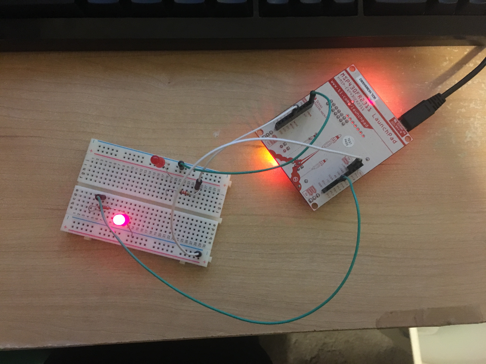
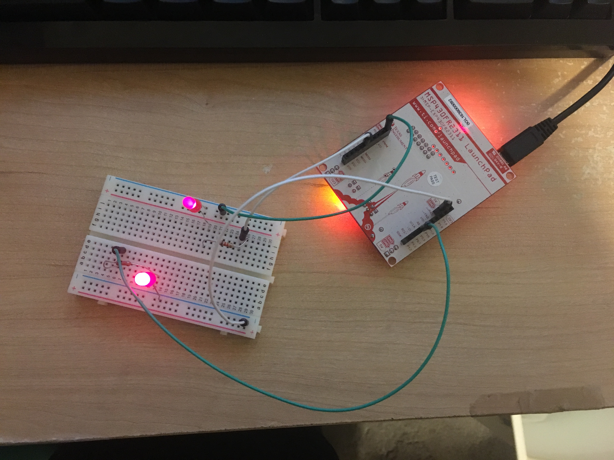

# Lab 2: Multiple Blink

## For each of the respective boards, a similar coding structure was used, but with different pinouts for the leds.

## MSP430F5529 
GREEN LED: P4.7

```c
/*
Matt Mammarelli
9/18/17
ECE 09342-2
*/

//MSP430F5529 multiple blink led

#include <msp430.h>				

void main(void)
{
    //WDTCTL is watchdog timer control
    //WDTPW watchdog timer + password, is an interrupt
    //WDTHOLD watchdog timer +hold, if 1 watchdog timer is stopped
    // Stop watchdog timer
	WDTCTL = WDTPW | WDTHOLD;

	
	
	//Enables port 1.0
	P1DIR |= BIT0;
	//Enables port 4.7
	P4DIR |= BIT7;

	//declared as volatile to indicate i can change at any time
	// volatile to prevent optimization.
	//c compiler optimization can automatically remove code that introduces intended delays
	volatile unsigned int i;

	//infinite while loop
	while(1)
	{
	    //Toggles P1.0 RED led
		P1OUT ^= BIT0;
		// creates the delay based on i
		for(i=50000; i>0; i--);

		//Toggles off P1.0 RED led makes asynchronous
		P1OUT ^= BIT0;
		//Toggles on P4.7 Green led
		P4OUT ^= BIT7;

		//delay
		for(i=10000; i>0; i--);

	}
}
```

## MSP430FR2311 
GREEN LED: P2.0

```c
/*
Matt Mammarelli
9/18/17
ECE 09342-2
*/

//MSP430FR2311 Multiple Blink led

#include <msp430.h>

void main(void) {

    //WDTCTL is watchdog timer control
    //WDTPW watchdog timer + password, is an interrupt
    //WDTHOLD watchdog timer +hold, if 1 watchdog timer is stopped
    // Stop watchdog timer
    WDTCTL = WDTPW | WDTHOLD;

    // Disable the GPIO power-on default high-impedance mode
    // to activate previously configured port settings
    //PM5CTL0 = Power mode 5 control register 0
    //LOCKLPM5 = Locks I/O pin, bit is reset by a power cycle
    //~LOCKLPM5=8'b0 and by anding PM5CTL0 it clears the register
    PM5CTL0 &= ~LOCKLPM5;

	
	
    //Enables port 1.0 as output
    P1DIR |= BIT0;
    //Enables Port 2.0 as output
    P2DIR |= BIT0;

    for(;;) //creates an infinite loop so blinks indefinitely
    {
        //declared as volatile to indicate i can change at any time
        // volatile to prevent optimization.
        //c compiler optimization can automatically remove code that introduces intended delays
        volatile unsigned int i;

        //Toggles P1.0 RED led
        P1OUT ^= BIT0;

        //red led delay
        i = 50000;
        //will decrement i unless i = 0
        do i--;
        while(i != 0);

        //Toggles P1.0 RED led, turns off if on, makes asynchronous
        P1OUT ^= BIT0;
        //Toggles P2.0 Green led
        P2OUT ^= BIT0;

        //red led delay
        i = 10000;
        //will decrement i unless i = 0
        do i--;
        while(i != 0);
    }
}
```

## MSP430FR5994 
GREEN LED: P1.1

```c
/*
Matt Mammarelli
9/18/17
ECE 09342-2
*/

//MSP430FR5994 Multiple Blink Led

#include <msp430.h>

void main(void) {

    //WDTCTL is watchdog timer control
    //WDTPW watchdog timer + password, is an interrupt
    //WDTHOLD watchdog timer +hold, if 1 watchdog timer is stopped
    // Stop watchdog timer
    WDTCTL = WDTPW | WDTHOLD;

    // Disable the GPIO power-on default high-impedance mode
    // to activate previously configured port settings
    //PM5CTL0 = Power mode 5 control register 0
    //LOCKLPM5 = Locks I/O pin, bit is reset by a power cycle
    //~LOCKLPM5=8'b0 and by anding PM5CTL0 it clears the register
    PM5CTL0 &= ~LOCKLPM5;


	
    //Enables port 1.0 and port 1.1 as output
    P1DIR |= (BIT0|BIT1);

    for(;;)//creates an infinite loop so blinks indefinitely
    {
        //declared as volatile to indicate i can change at any time
        // volatile to prevent optimization.
        //c compiler optimization can automatically remove code that introduces intended delays
        volatile unsigned int i;
        volatile unsigned int j;

        //Toggle P1.0 Red led
        //Exclusive or toggles
        P1OUT ^= BIT0;

        //red led delay
        i = 50000;
        do i--;
        while(i != 0);

        //Toggle P1.0 and P1.1, will turn off red led if on, turn on green led
        P1OUT ^= (BIT0|BIT1);

        //green led delay
        j = 10000;
        do j--;
        while(j!=0);
    }
}
```

## MSP430FR6989 
GREEN LED: P9.7

```c
/*
Matt Mammarelli
9/18/17
ECE 09342-2
*/

//MSP430FR6989 Multiple Blink LED

#include <msp430.h>

void main(void) {
    //WDTCTL is watchdog timer control
    //WDTPW watchdog timer + password, is an interrupt
    //WDTHOLD watchdog timer +hold, if 1 watchdog timer is stopped
    // Stop watchdog timer
    WDTCTL = WDTPW | WDTHOLD;

    // Disable the GPIO power-on default high-impedance mode
    // to activate previously configured port settings
    //PM5CTL0 = Power mode 5 control register 0
    //LOCKLPM5 = Locks I/O pin, bit is reset by a power cycle
    //~LOCKLPM5=8'b0 and by anding PM5CTL0 it clears the register
    PM5CTL0 &= ~LOCKLPM5;

	
	
    //Enables port 1.0 as output
    P1DIR |= BIT0;

    //Enables port 9.7 as output
    P9DIR |= BIT7;


    for(;;)//creates an infinite loop so blinks indefinitely
    {
        //declared as volatile to indicate i can change at any time
        // volatile to prevent optimization.
        //c compiler optimization can automatically remove code that introduces intended delays
        volatile unsigned int i;

        //Toggles P1.0 RED LED
        P1OUT ^= BIT0;

        //creates the delay between pulses, determines how fast it blinks
        i = 50000;
        //will decrement i unless i = 0
        do i--;
        while(i != 0);

        //Toggles P1.0 RED LED, turns it off if on, makes asynchronous with green
        P1OUT ^= BIT0;

        //Toggles P9.7 Green LED
        P9OUT ^= BIT7;

        //creates the delay between pulses, determines how fast it blinks
        i = 10000;
        //will decrement i unless i = 0
        do i--;
        while(i != 0);

    }
}
```

## MSP430G2553 
GREEN LED: P1.6

```c
/*
Matt Mammarelli
9/18/17
ECE 09342-2
*/

//MSP430G2553 Multiple Blink led

#include <msp430.h>				

void main(void)
{
    //WDTCTL is watchdog timer control
    //WDTPW watchdog timer + password, is an interrupt
    //WDTHOLD watchdog timer +hold, if 1 watchdog timer is stopped
    // Stop watchdog timer
	WDTCTL = WDTPW | WDTHOLD;

	
	
	//Enables port 1.0 and port 1.6 as output
	P1DIR |= (BIT0|BIT6);


	//declared as volatile to indicate i can change at any time
	// volatile to prevent optimization.
	//c compiler optimization can automatically remove code that introduces intended delays
	volatile unsigned int i;

	while(1) //infinite while loop
	{
	    //Toggle P1.0 Red led
	    //Exclusive or toggles
	    P1OUT ^= BIT0;
	    //delay for red led
	    for(i=50000; i>0; i--);

	    //Toggle P1.6 Green Led
	    //Exclusive or with BIT0 and BIT6 will turn off the red led if on and turn on the green led, makes asynchronous
	    P1OUT ^= (BIT0|BIT6);
		//delay for green led
		for(i=10000; i>0; i--);

	}
}
```

### Each new blink.c file contains a different delay loop for the red and green leds and includes an extra toggle for the red led to ensure that both leds are asynchronous

## Extra Work: MSP430FR2311 blinkExtra.c Blink more leds 
For the extra work I connected the headers from the P2.3 and P2.4 to two red leds on a breadboard and made them blink asynchronously.

## Code

```c
/*
Matt Mammarelli
9/18/17
ECE 09342-2
*/

//MSP430FR2311 Multiple Blink Led Extra

#include <msp430.h>

void main(void) {

    //WDTCTL is watchdog timer control
    //WDTPW watchdog timer + password, is an interrupt
    //WDTHOLD watchdog timer +hold, if 1 watchdog timer is stopped
    // Stop watchdog timer
    WDTCTL = WDTPW | WDTHOLD;

    // Disable the GPIO power-on default high-impedance mode
    // to activate previously configured port settings
    //PM5CTL0 = Power mode 5 control register 0
    //LOCKLPM5 = Locks I/O pin, bit is reset by a power cycle
    //~LOCKLPM5=8'b0 and by anding PM5CTL0 it clears the register
    PM5CTL0 &= ~LOCKLPM5;

	

    //Enables port 1.0 as output
    P1DIR = BIT0;
    //Enables Port 2.0 as output
    P2DIR = (BIT0|BIT3|BIT4);

    for(;;) //creates an infinite loop so blinks indefinitely
    {
        //declared as volatile to indicate i can change at any time
        // volatile to prevent optimization.
        //c compiler optimization can automatically remove code that introduces intended delays
        volatile unsigned int i;

        //Toggles P1.0 RED led
        P1OUT ^= BIT0;

        //red led delay
        i = 50000;
        //will decrement i unless i = 0
        do i--;
        while(i != 0);

        //Toggles P1.0 RED led, turns off if on, makes asynchronous
        P1OUT ^= BIT0;
        //Toggles P2.0 Green led
        P2OUT ^= BIT0;

        //red led delay
        i = 10000;
        //will decrement i unless i = 0
        do i--;
        while(i != 0);

        //Toggles P2.0 led, turns off if on, makes asynchronous
        P2OUT ^= BIT0;
        //Toggles P2.3 led
        P2OUT ^= BIT3;

        //P2.3 delay
        i = 20000;
        //will decrement i unless i = 0
        do i--;
        while(i != 0);

        //Toggles P2.3 led, turns off if on, makes asynchronous
        P2OUT ^= BIT3;
        //Toggles P2.4  led
        P2OUT ^= BIT4;

        //P2.4 led delay
        i = 30000;
        //will decrement i unless i = 0
        do i--;
        while(i != 0);


    }
}
```

## P2.3 On



## P2.3 and P2.4 On


