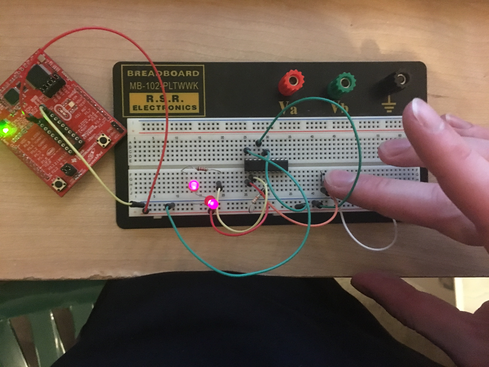
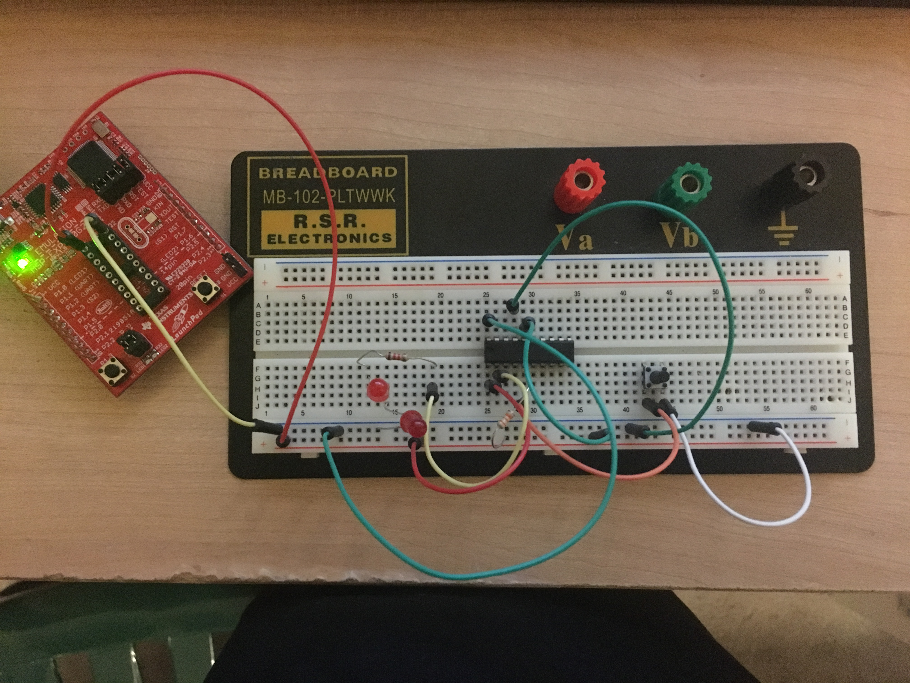
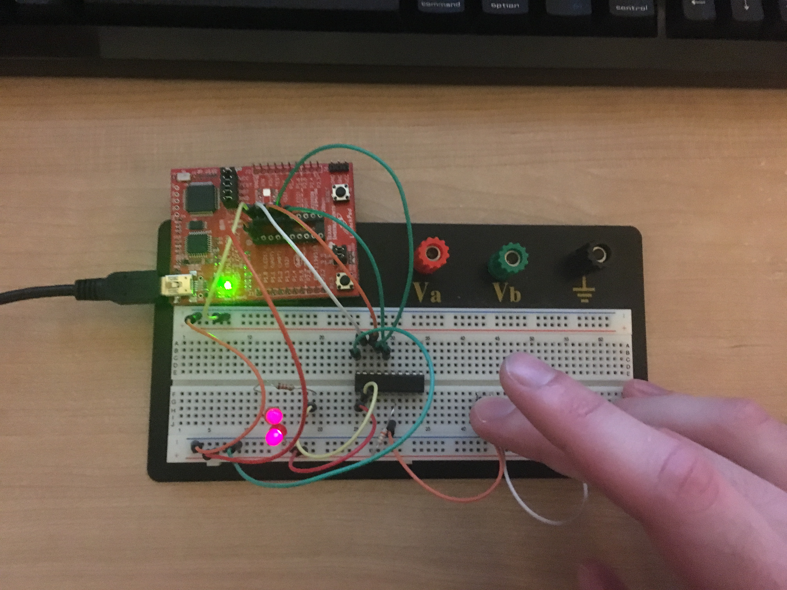

# Lab 2: Off Board Blink
For the off board blink, I used the identical code from the MSP430G2553 button blink.c. I extracted the processor from the development board and placed it on a breadboard wiring a circuit that replicated the functional circuits built into the actual development board

## Power Delivery

VCC and Gnd were ganged from the socketed pins on the development board over to the breadboard.

## Reset Circuitry

RST was ganged to VCC so that the MSP would function since reset is active low.

## Bypass Capacitors

For this circuit bypass capacitors could have been used but weren't necessary.


## Lab Blink On

When the button is pressed, the P1.3 line is brought low and the leds turn on.



## Lab Blink Off

When the button is not pressed, the P1.3 line is high due to the pullup resistor and the leds are off.



## Code

```c
/*
Matt Mammarelli
9/18/17
ECE 09342-2
*/

//MSP430G2553 Button Blink led
//sometimes pressing button makes led brighter instead of turning off

#include <msp430g2553.h>

void main(void)
{
    //WDTCTL is watchdog timer control
    //WDTPW watchdog timer + password, is an interrupt
    //WDTHOLD watchdog timer +hold, if 1 watchdog timer is stopped
    // Stop watchdog timer
    WDTCTL = WDTPW | WDTHOLD;

  

    //resistor enabled, input 1.3
    P1REN |= BIT3;

    //Sets Resistor to pullup, 1.0 is low, has to use = to initialize
    P1OUT = BIT3;

	//Enables port 1.0 as output, any bits that are 0 are treated as inputs
	P1DIR =BIT0;


	while(1) //infinite while loop
	{

	    //checks to see if input p1.3 is low
	    if (!((P1IN & BIT3)==BIT3)){
	        //toggles p1.0 red led
	        P1OUT ^= BIT0;
	    }


	}
}
```

## Extra: Offboard Programming
To accomplish offboard programming, I connected the headers for the XIN, XOUT, TEST, and RST from the development board to the corresponding pins on the breadboard. I changed the code so that the input pin was now P1.4 and successfully programmed the new code onto the microcontroller.



## Code blinkExtraOffboard.c

```c
/*
Matt Mammarelli
9/18/17
ECE 09342-2
*/

//MSP430G2553 Offboard extra
//sometimes pressing button makes led brighter instead of turning off

#include <msp430g2553.h>

void main(void)
{
    //WDTCTL is watchdog timer control
    //WDTPW watchdog timer + password, is an interrupt
    //WDTHOLD watchdog timer +hold, if 1 watchdog timer is stopped
    // Stop watchdog timer
    WDTCTL = WDTPW | WDTHOLD;

  

    //resistor enabled, input 1.3
    P1REN |= BIT4;

    //Sets Resistor to pullup, 1.0 is low, has to use = to initialize
    P1OUT = BIT4;

	//Enables port 1.0 as output, any bits that are 0 are treated as inputs
	P1DIR =BIT0;


	while(1) //infinite while loop
	{

	    //checks to see if input p1.3 is low
	    if (!((P1IN & BIT4)==BIT4)){
	        //toggles p1.0 red led
	        P1OUT ^= BIT0;
	    }


	}
}
```
